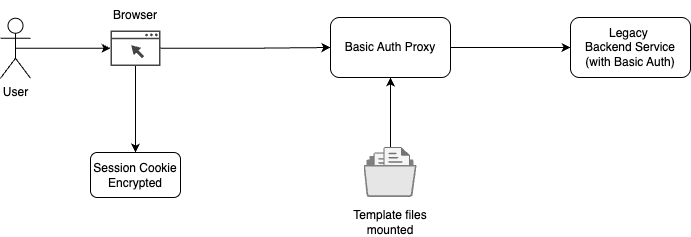
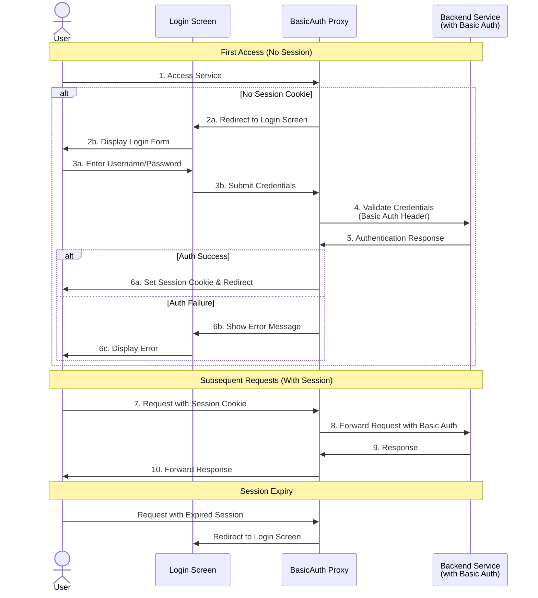

# BasicAuth Proxy

**BasicAuth-Proxy** is a brandable, lightweight reverse proxy designed to modernize and secure legacy applications that rely on HTTP Basic Authentication. By introducing an authentication layer that issues session-based credentials, the proxy mitigates many of the inherent risks and usability challenges associated with exposing Basic Auth directly to end users.

## Key Features:

* Brandable Login Screen – Customize the UI to match your brand.
* Session Management – Convert Basic Auth into session-based authentication.
* Secure Reverse Proxy – Acts as a gateway to upstream services with Basic Auth.
* Improved User Experience – Eliminates the need for users to enter credentials repeatedly.
* Seamless Integration – Drop-in replacement for services requiring Basic Auth.

Ideal for teams looking to modernize authentication without modifying upstream applications.

## Architecture

The following diagram illustrates how BasicAuth Proxy works:

## Usage

## Roadmap

- [ ] Support for SSL/TLS encryption
- [ ] Support for Let's Encrypt automatic certificate management
- [ ] Support for multiple upstream services
- [ ] Support for configurable cookie flags (secure, httpOnly, sameSite)
- [ ] Run behind another reverse proxy (X-Forwarded-For support)

## Author

  
   
  <strong>Arul</strong>
   
  
  
  

