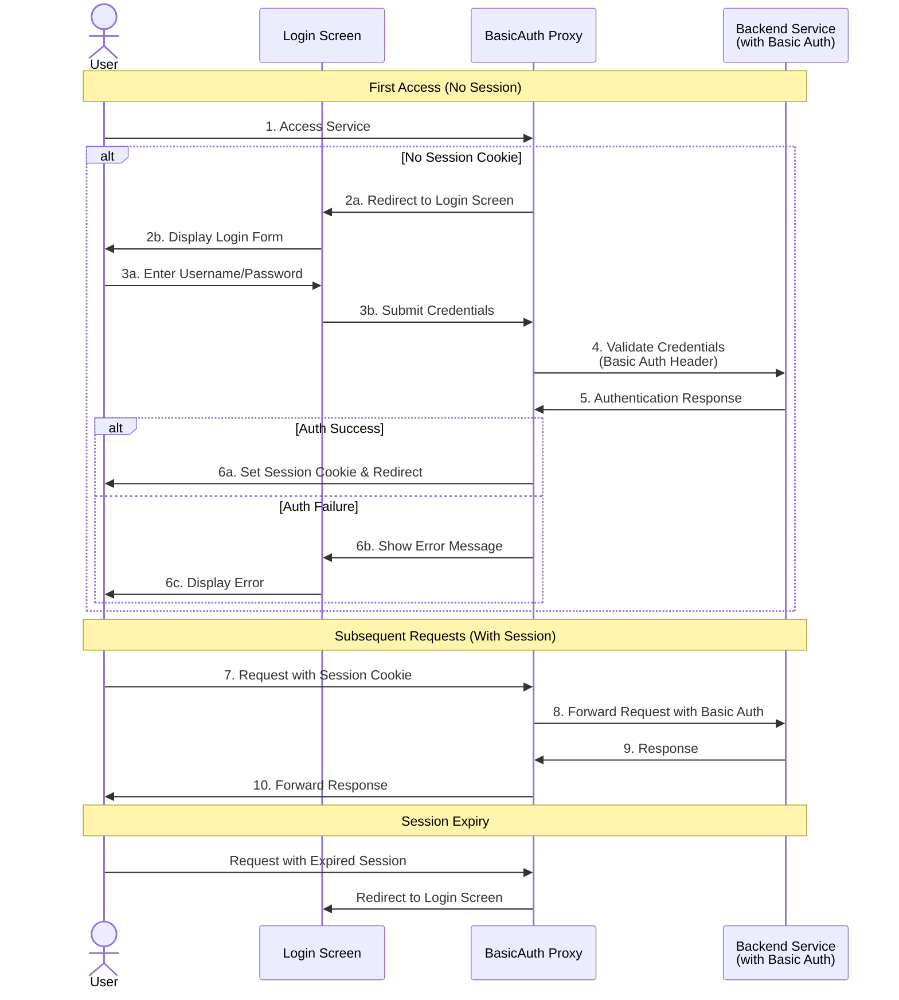

# BasicAuth Proxy

**BasicAuth-Proxy** is a lightweight, brandable reverse proxy designed to handle authentication for upstream services that use Basic Auth. Instead of exposing Basic Auth directly to users—along with its inherent security and usability drawbacks—this proxy provides a customizable login screen, session management, and improved security.

### Key Features:

* Brandable Login Screen – Customize the UI to match your brand.
* Session Management – Convert Basic Auth into session-based authentication.
* Secure Reverse Proxy – Acts as a gateway to upstream services with Basic Auth.
* Improved User Experience – Eliminates the need for users to enter credentials repeatedly.
* Seamless Integration – Drop-in replacement for services requiring Basic Auth.

Ideal for teams looking to modernize authentication without modifying upstream applications.

### Architecture

The following diagram illustrates how BasicAuth Proxy works:

### Usage
